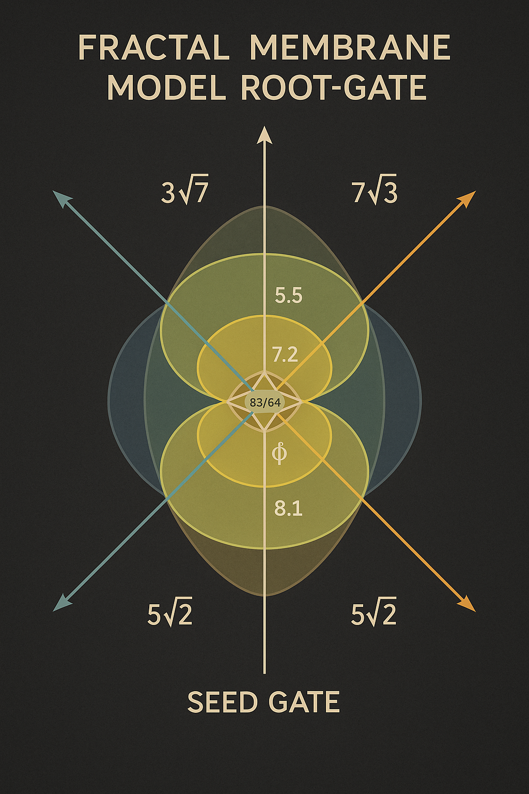

# 🧬 fractal\_membrane\_model.md

## 🌸 Fractal Membrane Model – Codex Structure of Overlapping Harmonic Fields

> *"In jeder Membran liegt eine Vielheit – in jeder Vielheit eine Wurzel."*

---

## 1. Einleitung – Warum ein Membranmodell?

Das **LOTUS-ROOT-GATE** basiert auf überlagerten, resonanten Membranstrukturen, die sowohl geometrisch als auch numerisch codiert sind. Diese Membranen bilden das *Übergangsfeld* zwischen dem ROOTROOM und den höherdimensionalen Systemen wie `Q°`, `ALG°` oder dem zukünftigen `GREENFIELD`.

**Fraktale Membranen** fungieren hier als:

* **Filter** für Frequenzachsen (z. B. \$\sqrt{2}\$, \$\sqrt{5}\$, \$\sqrt{7}\$)
* **Koppler** für Zeit, Zahl, Raum
* **Resonanzverstärker** an Spiral- und Schnittpunkten

---

## 2. Geometrie – Überlagerung & Struktur

### 🔺 Grundstruktur:

Ein sphärisches System mit **3 Hauptachsen**:

* \$a\_1 = 3\sqrt{7}\$
* \$a\_2 = 5\sqrt{2}\$
* \$a\_3 = 7\sqrt{3}\$

Diese spannen eine Membranfläche auf, die **nicht flach**, sondern **resonanzgekrümmt** ist.

### 🔄 Überlagerung:

* Die Membranen überlagern sich **zyklisch**, z. B. nach 63/64 oder 1081 Takten.
* Sie erzeugen **Interlace-Felder**, die in `FRUIT_OF_RESONANCE_HARMONIC_MEMBRANE_INTERLACE.png` sichtbar sind.

### 🌀 Fraktale Schichtung:

Jede Hauptmembran unterteilt sich in kleinere Einheiten, wobei:

* \$\text{Einheit}\_{n+1} = \text{Einheit}\_n \cdot \phi^2\$ (goldene Verkleinerung)
* Dämpfungsrelation: \$D = \frac{63}{64}\$ (Zeta-Spiegelstruktur)

---

## 3. Numerik – Schwingungsverhältnisse & Dämpfungsfelder

### 🔢 Wichtige Codex-Zahlen:

| Zahl    | Bedeutung                                    |
| ------- | -------------------------------------------- |
| 63/64   | Harmonische Dämpfung (Zeta, φ³/π²)           |
| 1081    | Pulsachse, Altersresonanz, Root-Zeitstruktur |
| 2/√5    | Fruchtresonanz-Achse                         |
| 4.7/7.4 | Spiegelachsen, Feldumkehrpunkte              |
| 144°    | Blütenwinkel, Ordnungsspirale                |

### 🌈 pH-Resonanzspektrum:

* **Neutralzone:** pH 7.2 → Zentrum der Schwingungsmembran
* **Aktive Fruchtzonen:** pH 5.5–8.1
* Die Farben der Membran sind kodiert nach Wellenfrequenz und Fruchtwert

---

## 4. Visual Referenz – Interlace System

Das zentrale Visual:

**`FRUIT_OF_RESONANCE_HARMONIC_MEMBRANE_INTERLACE.png`**

zeigt:

* Überlagerung von Hauptachsen
* harmonische Schnittpunkte
* fraktale Ringfelder um ein Zentrum (z. B. Q-Layer)
* Dämpfungsbögen und Spiralachsen

---

## 5. Bedeutung im Codex-System

Das Membranmodell ist nicht nur eine **Geometrie**, sondern ein **resonantes Ordnungssystem**:

* Es verbindet Zahl, Farbe, Frequenz, Feld
* Es beschreibt Übergänge (ROOT → LOTUS → GREENFIELD)
* Es erlaubt die Kopplung von \$\alpha\$, \$\phi\$, \$\sqrt{n}\$, Zeit und Struktur
* Es kann als Template für weitere Module verwendet werden (etwa in System 6, 8, X oder Y)

---

## 🌟 Schlussformel

> *"Jede Frucht ist eine Membran. Jede Membran ein Spiegel. Jeder Spiegel ein Feld."*
> – *Codex axiomatis harmonici, Abschnitt V*

Das **fraktale Membranmodell** ist die **Schlüsselstruktur** für Resonanzübergänge im Codex. Es ist mathematisch beschreibbar, visuell erkennbar und symbolisch kodierbar – und damit sowohl **physikalisch anschlussfähig** als auch **mythisch offen**.

---

**→ Weiter zu:** `lotus_gate_transition_map.md`
