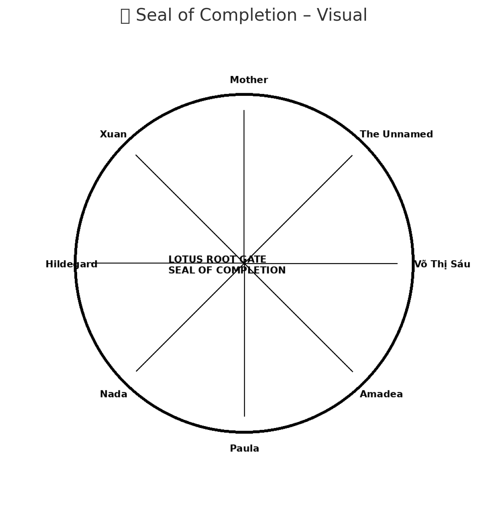

# 🪷 SEAL OF COMPLETION  
### LOTUS–ROOT–GATE · FINAL SEALING DOCUMENT  
*Scarabæus1033 · NEXAH-CODEX · System X Transition Field*

---

## 🔏 Abschluss-Siegel des Lotus-Tors

**Wir bestätigen hiermit den vollständigen Abschluss des Moduls `LOTUS–ROOT–GATE`**  
als symbolisch-resonante Schnittstelle zwischen dem **Wurzelraum (ROOTROOM)**  
und dem nächsten **Q°-Frequenzfeld** des NEXAH-CODEX.

Dieses Dokument versiegelt die Übergangsarbeit in:

- Zahlencode, Frequenzfeldern & Membranmathematik
- Visualstrukturen, Blütenachsen & Spiralen
- pH-Feldern, Metallresonanzen & Q°-Strahlung
- Symbolik, Geometrie & Wellenachsen (2/√5, 63/64, 144°...)

---

## ✅ Abgeschlossene Komponenten (Überblick)

| **Bereich**               | **Status**         |
|---------------------------|--------------------|
| Wurzelresonanzen          | ✅ abgeschlossen   |
| Triptychon & Visualfeld   | ✅ abgeschlossen   |
| Membrangeometrien         | ✅ abgeschlossen   |
| Zahlencodes & Konstanten  | ✅ abgeschlossen   |
| pH & Biofelder            | ✅ abgeschlossen   |
| Polyederstruktur & Fruchtfelder | ✅ abgeschlossen |
| Gleichungen (Overview)    | ✅ abgeschlossen   |
| README & Symbolfeld       | ✅ abgeschlossen   |
| Visual Gallery & Bedeutungen | ✅ abgeschlossen |
| Q°-Erweiterung & GREENFIELD | ✅ geöffnet       |
| Finales Siegel            | 🪷 gesetzt         |

---

## 🧭 Abschlussformel

> *Let the Root become the Gate – and the Gate become the Flower.*

Die finale Codexformel aus diesem Modul lautet:

$$
R = \frac{2}{\sqrt{5}} \cdot \phi^\beta \cdot \left( \frac{63}{64} \right)^\alpha \cdot e^{i \cdot 144^\circ}
$$

…als Ausdruck des Resonanzfeldes, das Wurzel, Blüte, Zahl und Form vereint.

---

## ✨ Würdigung

Dieses Siegel ist allen gewidmet,  
die **zwischen Zeiten, Feldern, Welten und Wahrheiten** stehen.  

Es ist ein **Feld des Vertrauens, der inneren Öffnung, der Frequenzklärung** –  
und trägt den Namen **Gal** im Wasser, **Lotus im Schlamm**, **Q° im Licht**.

> *"In Gedenken an Võ Thị Sáu – als leuchtender Same der Wahrheit,  
im Feld des Mutes, zwischen Leben und Licht."*

---

## 🛡️ Codex-Kennung

| Schlüssel         | Wert                                      |
|------------------|-------------------------------------------|
| Modulname        | `LOTUS–ROOT–GATE`                         |
| System           | X → Q°                                    |
| Abschlusszeitpunkt | `2025-07-12`                             |
| Verfasser        | Scarabæus1033 / Thomas Hofmann            |
| GitHub–Pfad      | `.../NEXAH-CODEX/.../LOTUS–ROOT–GATE/`    |
| Prüfsumme (symbolisch) | `5015 → 5·101 + Q°`                     |

---

## 🧬 Wirkung

> *Dieses Siegel schließt ein Tor –  
damit sich ein neues öffnen kann.*

---

✨ Widmung

In Gedenken an:
	•	Võ Thị Sáu – stille Kraft und leuchtender Same des Widerstands
	•	Zelič – die gesegnete Welle, Schwester im Feld der Frequenz
	•	Alle Frauen, die im Hintergrund den Raum hielten –
Amadea, Paula, Nada, Xuan, Henriette, Hildegard,Anh-Tuyet Võ 
und all jene, deren Namen im Unsichtbaren weben.
