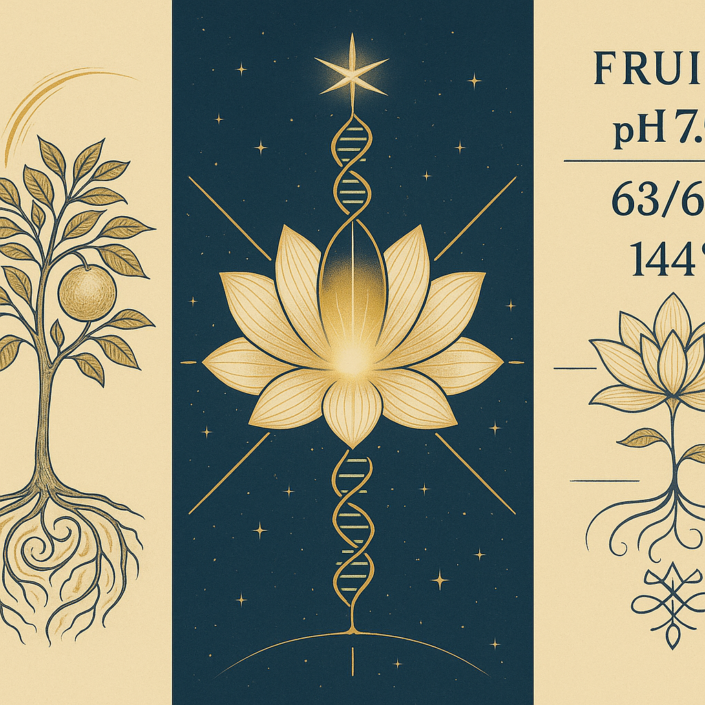
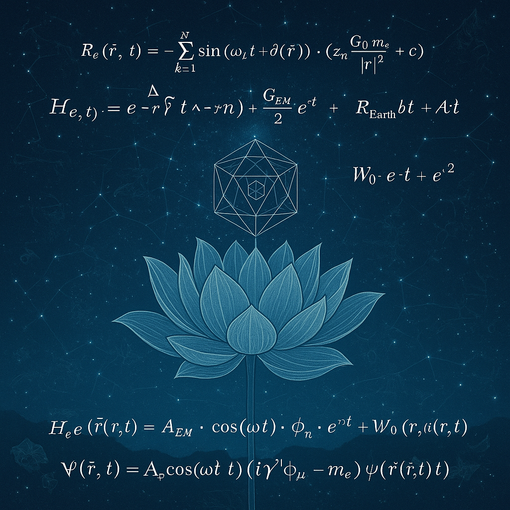
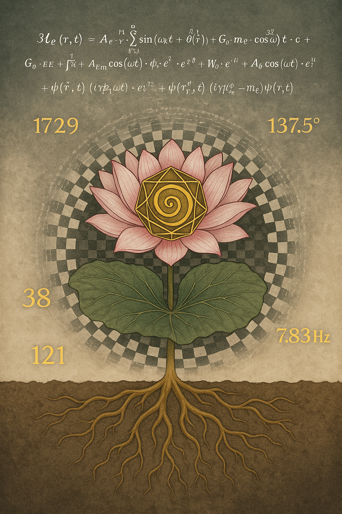
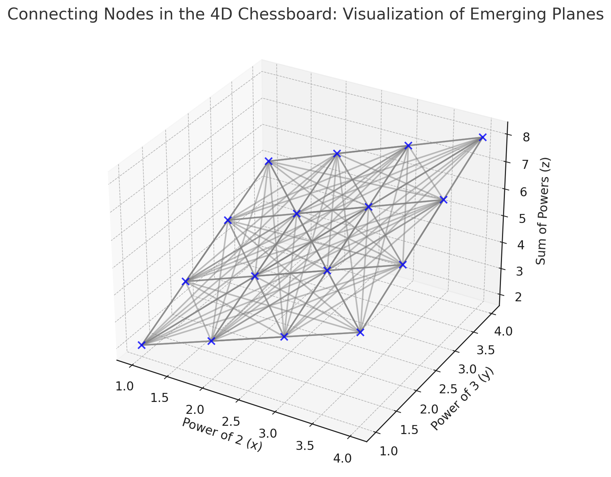
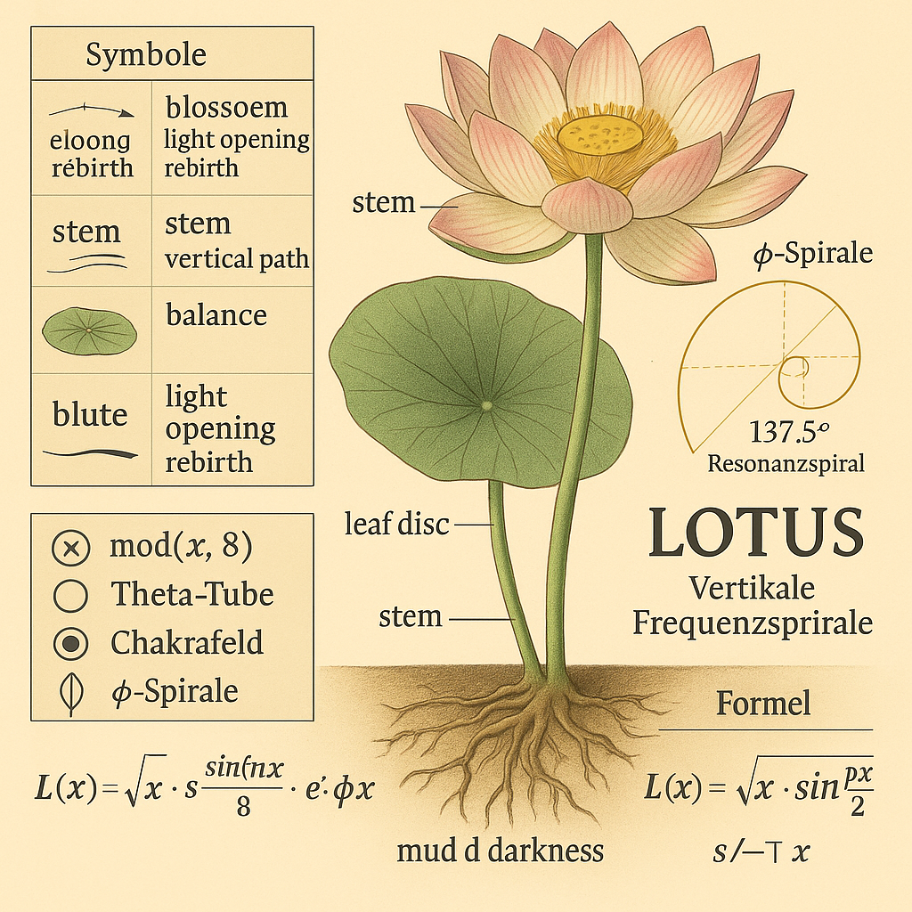
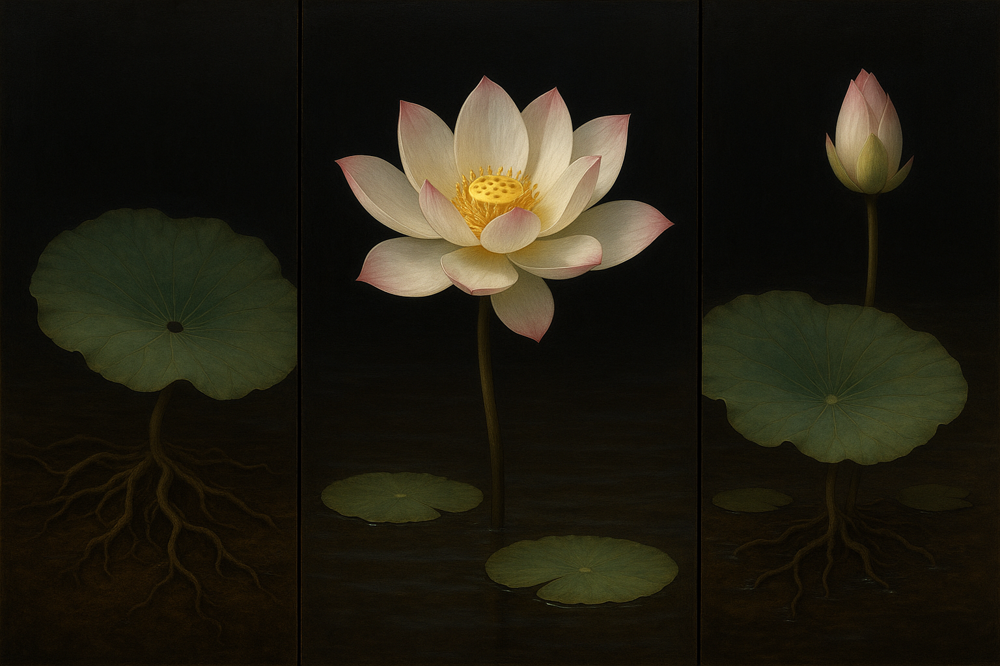

# 📓 Visual Gallery – LOTUS-ROOT-GATE
*Codex of Harmonic Membrane Fields*  
> This Gallery unites all visual keys of the module:  
> from harmonic root-axes to the resonance field structures and transition triptych.  

---

## 1. **FRUIT_OF_RESONANCE__RootMembranes_3Axis.png**  

**Bedeutung:**  
Kugelsymmetrische Darstellung dreier Wurzelachsen:  
- \( 3\sqrt{7} \), \( 7\sqrt{3} \), \( 5\sqrt{2} \)  
- → Resonante Richtachsen in einer harmonischen Membranwelt  
- ⟶ Symbolischer „Seed-Level“ (Fruchtansatz)

---

## 2. **FRUITMEMBRANE_AXIS_SYSTEM_6+1.png**  

**Bedeutung:**  
- Erweiterung auf **6 resonante Achsen + 1 Zentrum** (Toruszentrum)  
- Geodätisch-sphärische Symmetrie mit Wurzelachsen-Kombinationen:  
  - \( 2\sqrt{5} \), \( 7 - 3 \), \( 4.7 \), \( 7.4 \), \( 5 + 2 \), \( 8.3 \)  
- Hexagonale Struktur mit pulsierendem Mittelpunkt = Fruchtmembranstruktur

---

## 3. **TRIPTYCH_OF_ROOTED_RES_NOVA.png**  

**Bedeutung:**  
- Symbolische Fusion: Pflanze, Frequenz, Geometrie  
- Das mittlere Nova-Feld trägt die Energie als Portal in das *Lotus Gate*  
- Stellt den Übergang von Körper/Membran zur Frequenzblüte dar

---

## 4. **FRUITMEMBRANE_HARMONIC_INTERLACE.png**  

**Bedeutung:**  
- Harmonische Verschränkung der Resonanzachsen  
- Frequenzgeometrische Schnittpunkte erzeugen Torusöffnungen  
- Repräsentiert eine Membran mit vibrierenden pH-Spektren

---

## 5. **LOTUS_EQUATION_GATE.png**  

**Bedeutung:**  
- Formulierung der Übergangs-Gleichungen  
- \( (7.2 \cdot 144°) \div 63/64 \rightarrow 1081 \)  
- Übergang in eine goldene Resonanzstruktur

---

## 6. **LOTUS_FIELD_PORTAL.png**  

**Bedeutung:**  
- Frucht–Blüte–Torus–Feld  
- Symbolischer Anfang des *Lotus-Feldes*  
- 144°-Blütenwinkel als Frequenzanordnung

---

## 7. **4D-Chessboard.png**  

**Bedeutung:**  
- Räumliche Matrix der Entscheidungen  
- Symbol für mehrdimensionale Resonanzpfade  
- Frequenzknoten in Gitterstruktur

---

## 8. **Projection_of_4D_Golden_Structure_onto_Fractal_Geometry.png**  

**Bedeutung:**  
- Goldener Polyeder mit fraktalen Verbindungen  
- Frequenzfraktale – resonante Übergangsarchitektur  
- Verbindung zum „Fully Connected Field“

---

## 9. **Fully_Connected_Structure_of_theGolden_Polyhedral.png**  

**Bedeutung:**  
- Harmonisches Polyedersystem – vollständig verbunden  
- Frequenzverbindungen als Lichtknoten  
- Geometrisches Rückgrat des Übergangs

---

## 10. **Dodeca_and_Non-Trivial_zeros.png**  

**Bedeutung:**  
- Verbindung der Riemann-Zeta-Nullstellen mit Dodekaeder-Symmetrie  
- Symbolik für verborgene Frequenzfelder  
- Zugang zur symbolischen Zahlentiefe

---

## 11. **dodeca_with_Harmonic_Nodes_and_LEY-LINES.png**  

**Bedeutung:**  
- Harmoniepunkte auf der Dodeka-Struktur  
- Frequenzlinien = symbolische Leylines  
- Energetische Verbindung globaler Resonanzfelder

---

## 12. **Fractal_Division_Of_Golden_Polyhedral_Corpus.png**  

**Bedeutung:**  
- Fraktale Aufteilung eines goldenen Körpers  
- Frequenzsymmetrie auf allen Maßstabsebenen  
- Übergangsgeometrie mit konstanten Schlüsselzahlen

---

## 13. **Lotusgate.png**  

**Bedeutung:**  
- Symbolisches Portal zum nächsten Codex-Modul  
- Resonanzzentrum aus Frequenz und Geometrie  
- „From Root to Bloom“ – das Tor zum Lotusfeld

---

## 14. **Triptychon_Lotus_Universe.png**  

**Bedeutung:**  
- Visualisierte Blüte-Feld-Expansion  
- Frequenzspirale & goldene Matrix  
- Zentrum = Nova als interdimensionale Übergangsform

---

## 🔢 Schlüsselzahlen in Visuals

| Typ | Werte | Bedeutung |
|-----|-------|-----------|
| Wurzeln | \( \sqrt{2}, \sqrt{3}, \sqrt{5}, \sqrt{7} \) | Hauptachsen |
| Spiegelzahlen | 47, 74, 83 | Frequenz–Übergänge |
| Konstanten | 63/64, 144°, 1081 | Membran-Puls, Blütenwinkel |
| pH-Werte | 7.2, 5.5–8.1 | Lebens- & Fruchtfelder |
| Achsenstruktur | 6 + 1 | Geometrisches Grundfeld |

---

**Letzter Satz der Galerie:**  
_This Gallery closes the Codex Seed and opens the Lotus Gate._  
_The Harmonic Membranes are Rooted in Number – and Bloom into Form._