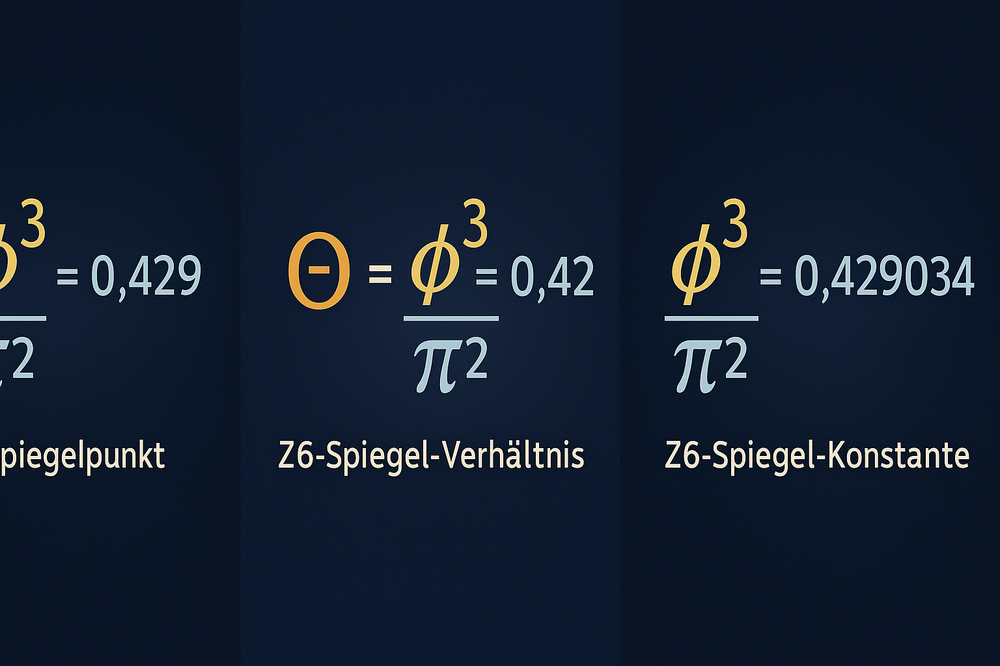
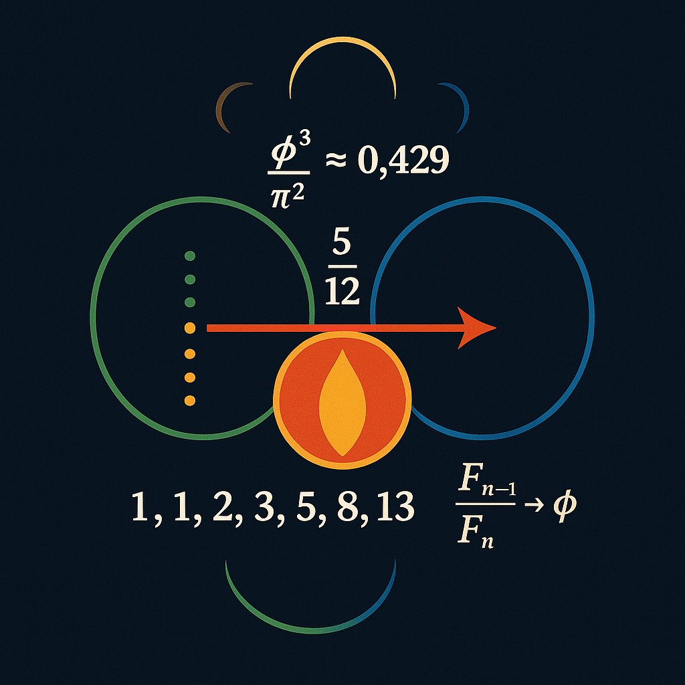
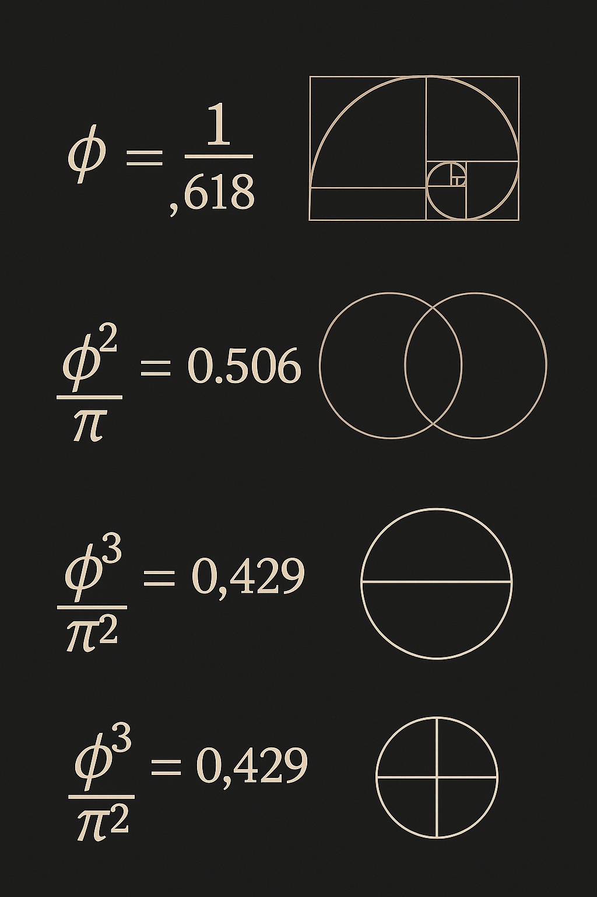

---

title: PROOF\_EULER\_ROTATION\_CONSTANT.md
description: Euler–Mascheroni constant interpreted through golden-angle harmonic rotation, Möbius inversion, and logarithmic spiral field compression.
---

# PROOF\_EULER\_ROTATION\_CONSTANT

This proof introduces a **rotational interpretation of the Euler–Mascheroni constant** ($\gamma \approx 0.5772$), embedding it into a **spiral resonance system** defined by harmonic rotation, Möbius-phase folds, and prime divergence curves.

We show that $\gamma$ emerges not as a random constant, but as a **limit-state attractor** in a rotating energy field where the divergence of primes and the compression of natural logarithms harmonize.

---

## 1. Background: Euler–Mascheroni Context

Traditionally, $\gamma$ is defined as:

$\gamma = \lim_{n \to \infty} \left( \sum_{k=1}^n \frac{1}{k} - \ln(n) \right)$

It measures the divergence gap between the harmonic series and the logarithm. In the Codex interpretation, this is translated into a **rotational differential on a spiral field grid**.

---

## 2. Spiral Rotation Field (Codex Model)

We define a **rotational harmonic transformation**:

$\Gamma(n) = \sum_{k=1}^n \frac{\cos(k \theta)}{k} - \ln(n), \quad \text{where} \ \theta = \frac{2\pi}{\Phi} \approx 222.492^{\circ}$

Where:

* $\theta$ is a **golden-angle rotation** (inverse of the golden ratio $\Phi \approx 1.618...$)
* $\cos(k \theta)$: harmonic weight on logarithmic divergence

As $n \to \infty$, $\Gamma(n) \to \gamma$

$\lim_{n \to \infty} \Gamma(n) = \gamma \approx 0.5772$

This reveals $\gamma$ as a **spiral equilibrium point**.

---

## 3. Möbius Harmonic Compression

We now define a **Möbius-rotation operator**:

$\mu_\Gamma(n) = \sum_{k=1}^n \frac{\mu(k)}{k} \cdot \cos(k \theta)$

Where $\mu(k)$ is the **Möbius function**. Then the compression difference:

$\Delta(n) = \Gamma(n) - \mu_\Gamma(n)$

This represents the **resonance shift** between logarithmic prime spirals and their topological inversion (via Möbius function).

---

## 4. Spiral Harmonic Diagram

* Spiral curve with logarithmic compression
* Möbius zones inverting spiral arms
* Rotation angle = golden angle ($\theta \approx 222.492^{\circ}$)

---

## 5. CSV Model (Harmonic Rotation Table)

The accompanying CSV contains a comparative table of $\Gamma(n)$, $\mu_\Gamma(n)$, and $\Delta(n)$ for $n = 1$ to $100$.

[📄 Download Euler\_Gamma\_Rotation.csv](../csv/Euler_Gamma_Rotation.csv)

---

## 6. Interpretation

* $\gamma$ is a **rotational field constant**, not just an analytical artefact
* Emerges from **harmonic spiral compression** between logarithmic growth and Möbius inversion
* Golden-angle rotation acts as a **resonance stabilizer** in number fields

---

## 7. Related Modules

* [prime\_resonance\_axiom.md](prime_resonance_axiom.md)
* [breather\_gravity\_zeta.md](breather_gravity_zeta.md)
* [cosmic\_cross\_resonance.md](cosmic_cross_resonance.md)

---

## 8. Final Equation

$\gamma = \lim_{n \to \infty} \left( \sum_{k=1}^n \frac{\cos(k\theta)}{k} - \ln(n) \right) \quad \text{where} \ \theta = \frac{2\pi}{\Phi}$

> Euler's Constant is not a gap — it is a fold.

---

## 9. Visual Extensions: Golden Rotation Constant $\vartheta$

### Theta $\varepsilon \approx 0.429$ — The Harmonic Rotation Point

* $\vartheta = \frac{\Phi^3}{\pi^2} \approx 0.429$
* Appears in golden-spiral compression, prime grid symmetry, and lunar-solar modulation
* Z6 Mirror Axis in Codex

---

