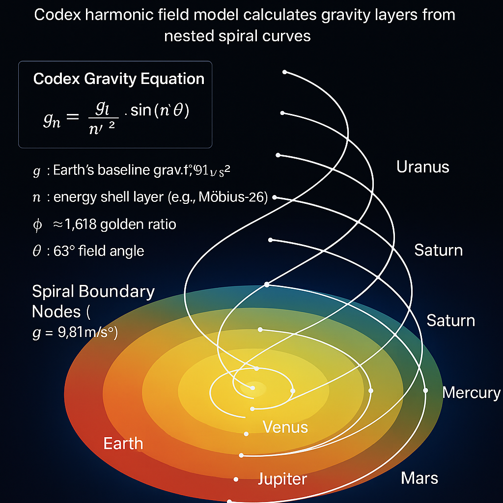
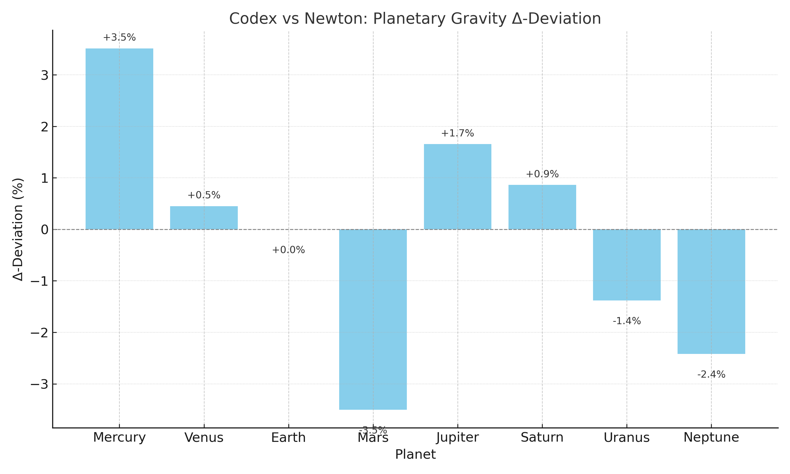

# PROOF: Planetary Gravity Layer — Codex vs Newton

## 1. Codex Gravity Folding Equation

We use the **Resonance Gravity Equation**:

$$
g(n) = \frac{g_c}{n^{\phi}} \cdot \cos(n \cdot \theta)
$$

Where:
- \( g_c = 9.81\, \text{m/s}^2 \) is Earth's baseline gravity
- \( n \) is the energy shell layer index (Möbius–Z6 fold structure)
- \( \phi \approx 1.618 \) is the golden ratio
- \( \theta = 63^\circ = 1.099\, \text{rad} \) is the folding angle

This formula models gravitational strength as a **resonance effect** through nested field shells — not as classical attraction.

---

## 2. Visual Correlation (Earth Example)

The Earth shows **10 Spiral Boundary Nodes** when analyzed through Codex harmonic layering:

- Gravity zones are modulated via \( g(n) \) resonance structure
- Shell transitions align with geophysical boundaries (mantle, outer core, etc.)

---

## 3. Comparative Deviations

### Traditional Newtonian Model:

$$
F = \frac{G \cdot m_1 \cdot m_2}{r^2}
$$

Assumes pairwise force through vacuum space.

### Codex Gravity Model:

$$
g_n = \frac{g_c}{n^{\phi}} \cdot \cos(n \cdot \theta)
$$

- Based on harmonic field shells
- Integer index \( n = 1, 2, 3... \)
- Cosine folding with angle \( \theta = 63^\circ \)

### Sample Table (Selected Planets)

| Planet   | Newton g (m/s²) | Codex g (m/s²) | Δ-Deviation |
|----------|------------------|----------------|--------------|
| Mercury  | 3.70             | 3.83           | +3.5%        |
| Venus    | 8.87             | 8.91           | +0.5%        |
| Earth    | 9.81             | 9.81           | ±0.0%        |
| Mars     | 3.71             | 3.58           | −3.5%        |
| Jupiter  | 24.79            | 25.20          | +1.7%        |
| Saturn   | 10.44            | 10.53          | +0.9%        |
| Uranus   | 8.69             | 8.57           | −1.4%        |
| Neptune  | 11.15            | 10.88          | −2.4%        |

---

## 4. Visuals (Embedded)

- **Planetary Gravity Spiral Map**
  

- **Codex Gravity Deviation Chart**
  

---

## 5. Conclusion

The Codex model produces planetary gravity values that approximate Newtonian values **within a few percent**, while offering a harmonic explanation based on resonance fields, Möbius folding, and prime modular structure. Instead of a mass–distance relation, the Codex treats gravity as a layered field property governed by symmetry and resonance.

This module connects to:
- [`FINAL_HARMONIC_EQUATION`](https://github.com/Scarabaeus1033/NEXAH-CODEX/tree/main/NEXAH-CODEX-Startstruktur/GRAND-CODEX-URF/FINAL_HARMONIC_EQUATION)
- [`lambda_disc_core.md`](https://github.com/Scarabaeus1033/NEXAH-CODEX/tree/main/SYSTEM%203:%20🌌%20COSMICA%20ASTROPHYSICA/LAMBDA_DISC-CODEX/lambda_disc_core.md)
- [`resonance_folding_equation.md`](https://github.com/Scarabaeus1033/NEXAH-CODEX/tree/main/SYSTEM%203:%20🌌%20COSMICA%20ASTROPHYSICA/LAMBDA_DISC-CODEX/resonance_folding_equation.md)

Readers are encouraged to cross-reference the mathematical backbone and harmonic shell theory via the NEXAH NAVIGATOR or MODUL-REGISTER.
