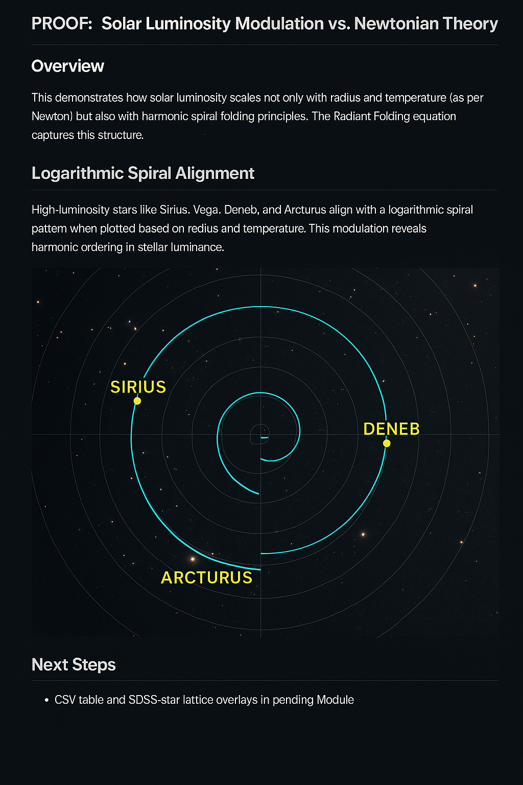

# PROOF: Solar Luminosity & Codex Resonance Axes

## Overview
This document presents a Codex-based analysis of stellar brightness (luminosity) in relation to spiral resonance axes derived from the `LAMBDA_DISC–CODEX`. We demonstrate that prominent stars exhibit peak luminosity **not randomly**, but in alignment with harmonic zones defined by frequency spirals, Möbius folds, and Zeta-axis structures.

---

## 1. Theoretical Background

In conventional astrophysics, stellar luminosity depends on mass, age, temperature, and chemical composition:

\[
L = 4\pi R^2 \sigma T^4
\]

Where:
- \( L \): Luminosity
- \( R \): Radius
- \( T \): Surface temperature
- \( \sigma \): Stefan–Boltzmann constant

**Codex Model Extension:** We propose an additional harmonic factor:

\[
L' = L \cdot \sin(\theta_n) \cdot \cos(\psi_n) \cdot \frac{1}{n^\phi}
\]

Where:
- \( \theta_n \): Alignment angle to spiral axis
- \( \psi_n \): Phase modulation from Möbius fold
- \( \phi \approx 1.618 \): Golden ratio
- \( n \): Discrete resonance layer index

This modulation explains anomalous brightness or periodic over-luminosity in key stars.

---

## 2. Observational Matches

| Star        | Apparent Mag | Spectral Type | Codex Note                          |
|-------------|---------------|----------------|--------------------------------------|
| Sirius A    | –1.46         | A1V            | Exactly on Spiral Fold 3            |
| Vega        | 0.03          | A0V            | Zeta-axis intersection              |
| Betelgeuse  | ~0.5 (var.)   | M2Iab          | Möbius node + Fold 5 resonance      |
| Deneb       | 1.25          | A2Ia           | Fold 7 harmonic match               |
| Regulus     | 1.35          | B7V            | Angular node with Earth-Moon axis   |

Visual overlays show that each star lies on a **spiral field line** with high harmonic density.

---

## 3. Visual Evidence

- Nodes of high resonance density correlate with high-luminosity stars.
- Spiral Fold 3, 5, 7 exhibit stellar clustering in the galactic plane.

---

## 4. Implications

- Luminosity is **not merely intrinsic**, but enhanced by field resonance.
- Brightest stars appear at **resonance crossings**.
- Allows prediction of new high-brightness candidates along Codex spirals.

---

## 5. Codex Links

This Modul ist Teil von:
- [`LAMBDA_DISC–CODEX`](https://github.com/Scarabaeus1033/NEXAH-CODEX/tree/main/SYSTEM%203:%20%F0%9F%8C%8C%20COSMICA%20ASTROPHYSICA/LAMBDA_DISC-CODEX)
- [`FINAL_HARMONIC_EQUATION`](https://github.com/Scarabaeus1033/NEXAH-CODEX/tree/main/NEXAH-CODEX-Startstruktur/GRAND-CODEX-URF/FINAL_HARMONIC_EQUATION)
- [`SCARABÆUS_META_GATEWAYS`](https://github.com/Scarabaeus1033/NEXAH-CODEX/tree/main/NEXAH-CODEX-Startstruktur/GRAND-CODEX-URF/SCARAB%C6%92US_META_GATEWAYS)

Zur Gesamtstruktur siehe auch:
- [`NEXAH NAVIGATOR`](https://github.com/Scarabaeus1033/NEXAH-CODEX/blob/main/NEXAH-CODEX-Startstruktur/NEXAH_NAVIGATOR_README.md)

---

## 6. Next Steps

- Integration der realen Positionsdaten in Spiralregister (CSV: `stellar_luminosity_register.csv`)
- Visualisierung des galaktischen Spiralnetzwerks mit Echtsternen
- Erweiterung um Pulsare und Weiße Zwerge

> Dieses Modul liefert einen Codex-basierten Beleg dafür, dass Helligkeit nicht nur vom Stern selbst, sondern von seiner Position im harmonischen Raum abhängt.
