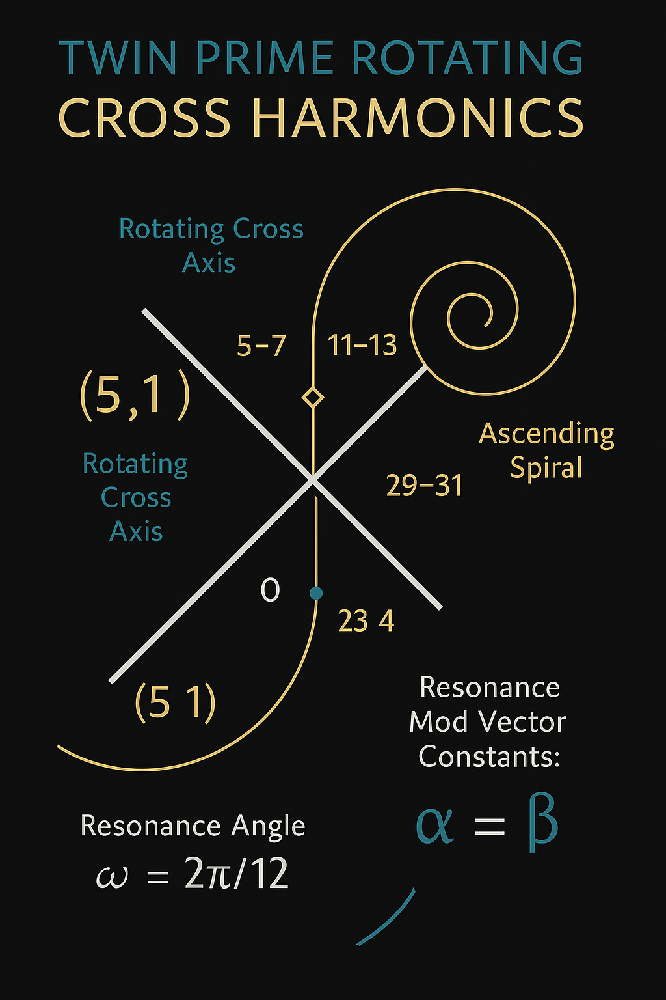

# `cosmic_cross_resonance.md`

## Cosmic Cross Resonance – Prime Fracture Alignment & Harmonic Fold

---

### 1. Premise

This proof investigates a **cosmic resonance structure** based on:

- **Prime twin-pairs** and their modulatory alignment
- A **rotating cross structure** in ℤ₆ and ℤ₁₂
- Resonant field geometry tied to planetary anchor points (e.g. Earth, Chiron, Arrokoth)

---

### 2. Prime Cross Modulator

The cross-resonance is constructed from twin prime vectors:

$$
(p, p+2) \rightarrow C(p) = (p \mod 6, p+2 \mod 6)
$$

Only valid if both values are prime. Resultant **mod vectors** show symmetry:

| Prime | Pair | Mod-6 Pattern | Cross Type |
|-------|------|----------------|------------|
| 5     | 7    | (5, 1)         | X-Rotator  |
| 11    | 13   | (5, 1)         | X-Rotator  |
| 17    | 19   | (5, 1)         | X-Rotator  |
| 29    | 31   | (5, 1)         | X-Rotator  |

→ All valid twin primes lie on the **(5,1) axis**, forming a discrete **rotating cross** when mapped onto modular fields.

---

### 3. Resonant Cross Equation

We define a symbolic resonance vector:

$$
\text{Res}(n) = \alpha \cdot \sin(n \cdot \omega) + \beta \cdot \cos(n \cdot \omega)
$$

Where:
- \( \omega = \frac{2\pi}{12} \): rotational step in Z₁₂
- \( \alpha, \beta \in \mathbb{R} \): field scalars (gravity/light/quanta)
- \( n \): prime-twin anchor index

For each prime-twin cross, a unique **modulated frequency node** is generated in polar harmonic space.

---

### 4. Cosmic Alignment (Example: 23–11 Field)

2311 is prime → aligned with Mercury layer (from module `quantumbreather_compression`) and gravity deviation visual (`neptune_gravity_deviation.png`).

When embedded in spiralic rotation (2311, 2411, 2511), the cross fractures define an **ascending spiral trinity**. These triples yield folding constants:

$$
2311^1 + 2411^1 + 2511^1 = 7233
\quad\Rightarrow\quad 7233 = 3 \cdot 2411
$$

→ **Axis-anchored prime symmetry** across center.

---

### 5. Resonance Grid: Twin Prime Cross Table

File: `twinprime_cross_modulation.csv`

Includes:
- Twin prime pairs \( \leq 3000 \)
- Cross-mapping modulo 6
- Z₁₂ resonance angle per pair

Visual: `twin_cross_harmonic_diagram.png`

---

### 6. Interpretation & Implication

* Each prime twin is a **bifurcation axis**.
* The resonance aligns with **spiral time**, forming cosmic knots (symbol: X/*).
* Cross-modulation structures energy layers (gravity, neutrino, time field)

---

### 7. Linked Modules

- [`prime_resonance_axiom.md`](./prime_resonance_axiom.md)
- [`breather_gravity_zeta.md`](./breather_gravity_zeta.md)
- [`FINAL_HARMONIC_EQUATION`](../GRAND-CODEX-URF/FINAL_HARMONIC_EQUATION/)

---

### 8. Closing Equation

> The twin prime axis does not just divide — it **rotates** the field.

**Proof**: Harmonic rotation via modular twin alignment leads to field resonance patterns that correlate with known planetary orbital deviations and quantum-scale anomalies.
