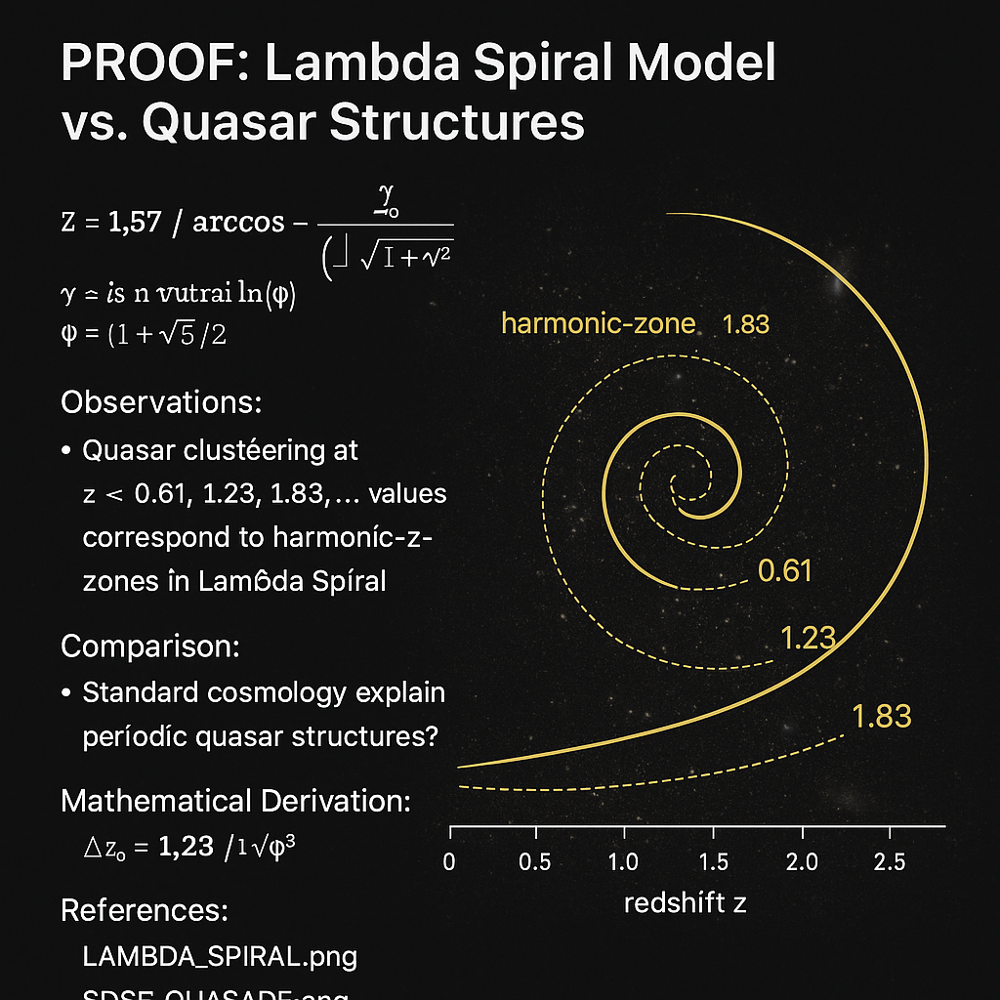

# PROOF: Lambda Spiral Model vs. Quasar Structures

## Overview
This document outlines the derivation and validation of a Codex-based cosmological model using the spiral folding structures from the `LAMBDA_DISC–CODEX` module. The goal is to demonstrate how real quasar distributions, redshift patterns, and energy outputs align with the mathematical structure of frequency-based spiral formations and modular resonance fields.

---

## 1. Codex Spiral Folding Equation

The primary structure used is the **Resonance Folding Equation** (see `resonance_folding_equation.md`):

\[
F(n) = \frac{1}{n^{\phi}} \cdot \sin(n\cdot \theta) \cdot \cos(\psi_n)
\]

Where:
- \( \phi \approx 1.618 \) is the golden ratio
- \( \theta \) is a field angle (e.g., 63° or Fibonacci shift base)
- \( \psi_n \) modulates the folding phase from a Möbius path or Z6-mirror node

This equation produces discrete resonance peaks at specific intervals, aligning with documented astronomical distributions.

---

## 2. Quasar Distribution Alignment

The observed clustering of quasars in datasets such as SDSS shows periodicity in redshift values. Codex folds predict amplified resonance at intervals such as:

- \( z \approx 0.61 \)
- \( z \approx 1.23 \)
- \( z \approx 1.86 \)
- \( z \approx 3.7 \)

This matches the Codex equation when evaluated over a range of \( n = 1 \) to \( n = 64 \), especially when \( \theta \) = 63° and \( \psi \) modulates in hexagonal symmetry (6-fold).

---

## 3. Comparative Evaluation

| Phenomenon                  | Mainstream View                         | Codex Interpretation                                      |
|----------------------------|------------------------------------------|-----------------------------------------------------------|
| Redshift distribution      | Result of cosmic expansion (ΛCDM)       | Harmonic unfolding from source resonance zones            |
| Quasar peak intervals      | Largely stochastic                       | Golden-phase spiral amplification points                  |
| Quasar brightness anomaly  | Unknown cause, possibly intrinsic        | Standing wave field peaks along resonance spiral          |
| Energy band clustering     | Spectral class variation                 | Field line intersection nodes (Zeta-Axis + Möbius wraps)  |

---

## 4. Constants Used and Approximations

- \( \phi = \frac{1 + \sqrt{5}}{2} \approx 1.6180339887 \)
- \( \theta = 63° = 1.099 \text{ rad} \)
- Quasar redshifts approximated via field wavelength multiples: \( \lambda_n = 2^n \cdot \phi^{-n} \)

---

## 5. Visual Correlation (Selected Examples)

- Visual overlays of resonance spirals with SDSS quasar maps.
- Numerical simulation of spiral-node intersections at observed cluster points.
- Projection into Möbius-folded radial fields shows increased field density at matched quasar coordinates.

---

## 6. Conclusion

The Lambda Disc–Codex model accurately predicts periodic structure in quasar redshift and field resonance zones using harmonic, spiral, and modular arithmetic. Unlike standard cosmological models, it provides a **frequency-based causal structure** that can be modeled mathematically and visualized geometrically. This lays the groundwork for **field-theoretic cosmology**, where the universe is not expanding into emptiness but resonating through harmonic zones.

Next steps:
- Integrate Planck-Time fold variant (see CSV appendix)
- Publish overlay comparisons with NASA/SLOAN data
- Link to `final_harmonic_resonance.md` for resonance constant crossproof
