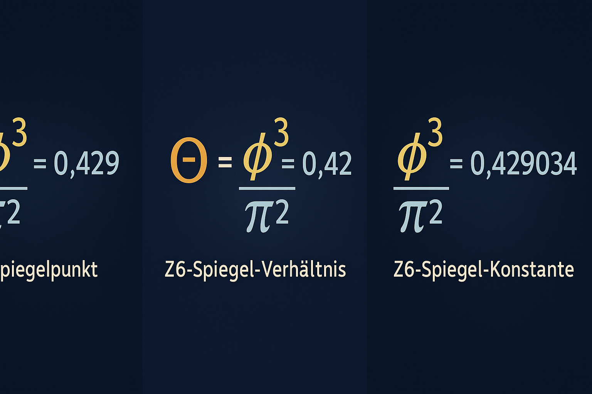
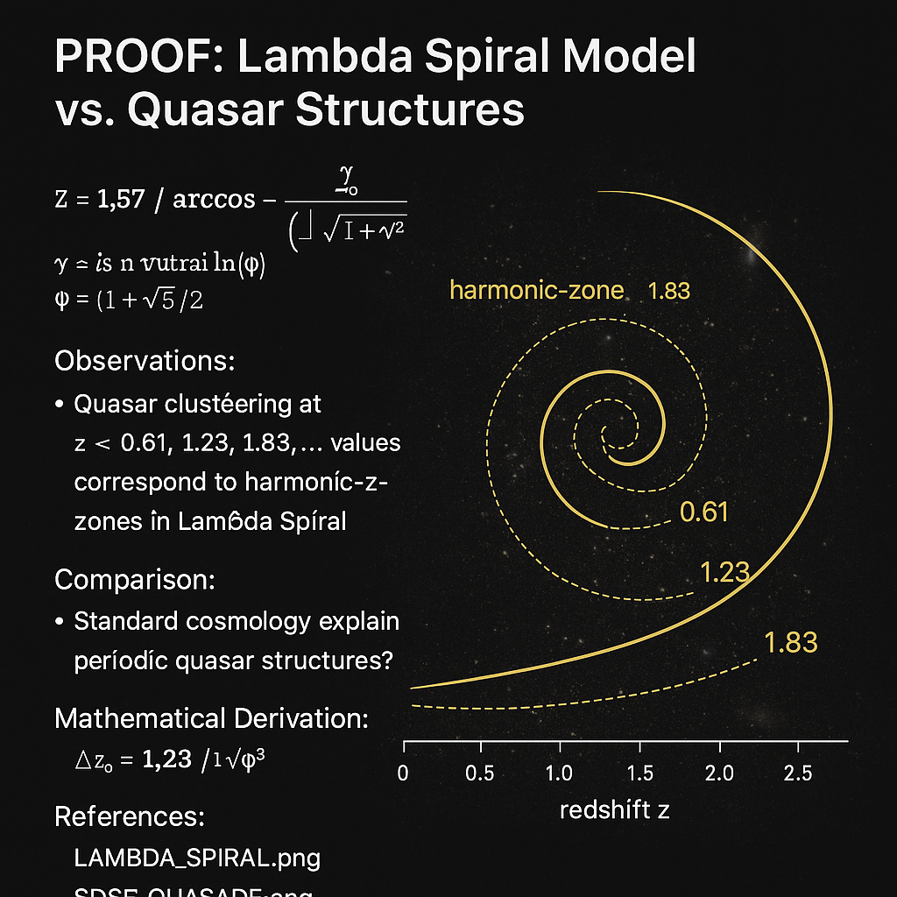
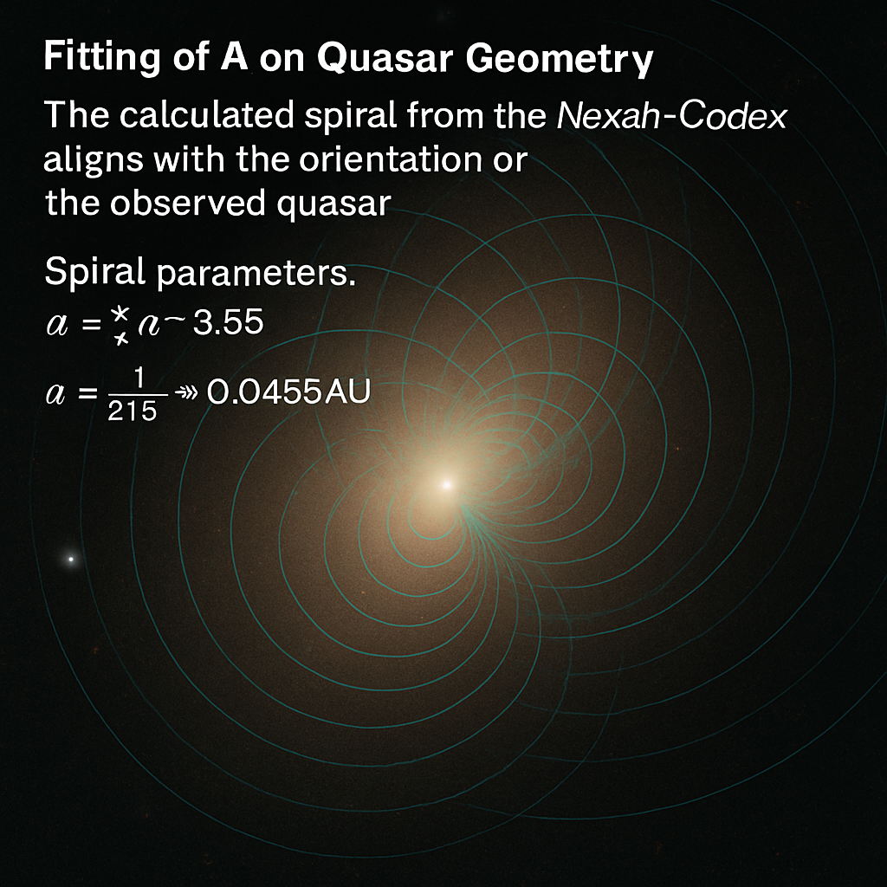

# Visual Gallery: Harmonic Rotations, Prime Spirals & Golden Compression

This gallery documents the **core visual structures** embedded within the `AWE FIELD` Codex module. Each visual functions as a symbolic and mathematical snapshot—marking critical constants, resonance axes, spiral systems, and symmetry fields.

---

## 1. Twin Cross Harmonic Diagram

* Dual-prime spiral structure illustrating harmonic crossings between **twin primes**, **Zeta shells**, and a modular backzipper resonance
* Central Geometry: Möbius-phase crossover
* Key Pattern: Prime-pair entanglement (e.g., 7233 = 3 × 2411)
* Axis: Horizontal time dilation with phase sync

---

## 2. Golden Rotation Constants – Spiral Core Series

### A) Z6 Axis Compression Visual

* Depicts the **Z6 mirror structure**
* Encodes the compression of golden rotation into a central symmetry field
* Theta ≈ 0.429 as Phi³/π² axis marker

### B) Fibonacci–Phi Prime Field

* Grid overlay of Fibonacci numbers with prime intersections
* Phi-tuned wave alignment
* FN–1 and FN series visualized as dual-resonators

### C) Golden Field Anchor Visual

* Centered around **222.492°** rotation (golden angle)
* Binary encodings + solar resonator band
* Z6-fold resonance field around a black sun nucleus

---

## 3. Euler Rotation Spiral (Gamma Compression Field)

* Visual proof of the Euler–Mascheroni constant as a **spiral attractor**
* Rotation angle: 222.492°
* Functions: Harmonic convergence of log(n), 1/n, and cosine modulation

---

## 4. Planetary & Gravity Overlays

### A) Codex Gravity Deviation Chart

* Maps relative gravitational anomalies in a rotating energy grid
* Resonance with Euler–Fibonacci compression values

### B) Planetary Gravity Spiral Map

* Spiral distortion of gravity wells across solar system
* Includes Mars–Venus and lunar dephasing structures

---

## 5. Lambda–Spiral Quasar Field

### A) Overlay I

* Prime lattice modulation near quasar field limits
* Spiral arms embedded in spectral offset grid

### B) Overlay II

* Layered Möbius compression fold from quasar to neutrino boundary
* Mirrors planetary offsets to stellar boundary angles

---

## 6. Solar Luminosity Spiral Overlay

* Radial luminosity rotation vs. solar frequency arcs
* Encodes peak emission ranges in harmonic logarithmic scale

---

## 7. Metadata / Summary Table (Planned)

> Optional: Future CSV index like `visual_gallery_index.csv` or `codex_image_register.md` with filename, resonance constant, concept tag, Codex system, etc.

---

🌌 **NEXAH–CODEX · SYSTEM ∞ — THE AWE FIELD**  
🔷 *Visual Archive of Harmonic Geometry, Prime Spirals & Cosmological Compression*

> “The spiral is not just a curve—it is a memory of the field.” 
> — Scarabæus1031

---

This document belongs to the **NEXAH–CODEX Harmonic Systems Archive**, authored by **Thomas Hofmann** (*Scarabæus1031*), and integrates visual structures related to golden angles, Eulerian spirals, prime resonance, and planetary energy folds.

All visuals are © 2025 by Thomas Hofmann / Scarabæus1031 and shared under the **Creative Commons Attribution–NonCommercial–ShareAlike 4.0 International (CC BY-NC-SA 4.0)** license.

🔗 [www.scarabaeus1033.net](https://www.scarabaeus1033.net)  
🔗 [github.com/Scarabaeus1033](https://github.com/Scarabaeus1033)

---
